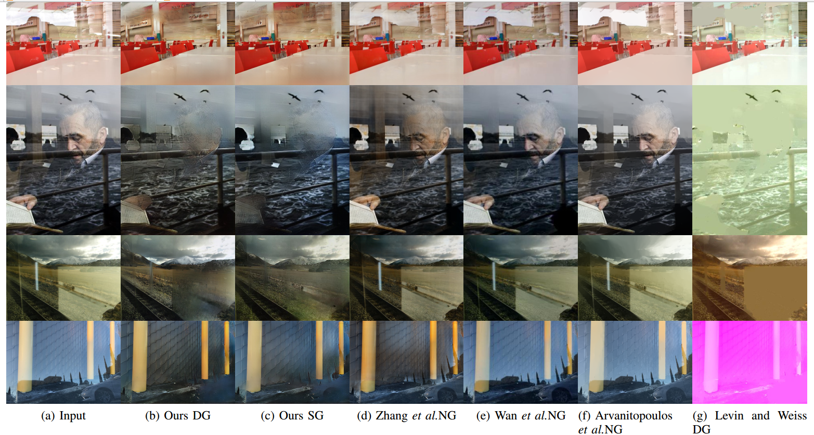

# U-FRRN

[Fast User-Guided Single Image Reflection Removal via Edge-aware Cascaded Networks](https://www.baidu.com)

### Representitive Results

Different levels of user guidance. SG means sparse guidance and DG means dense guidance. 

### Qualitative Comparison



## Environment Preparing

```
python2.7
torch==0.4.1
torchvision==0.2.0
numpy
cv2
```

You can install the supports with `pip install -r requirement.txt`. Here we only provide the GPU version code!

#### Dataset preparing

Prepare the background synthetic dataset [SUN2012](https://groups.csail.mit.edu/vision/SUN/), reflection synthetic dataset [VOC2012](http://host.robots.ox.ac.uk/pascal/VOC/voc2012/), and test dataset [SIRR](https://sir2data.github.io/ ), then change the `root` in `train.py`. 

We have already prepared several demo validation images in `./demo/`,  we use pictures in  `input` as original input, and pictures in `edge_R` and `edge_B` as user-guide hints.

#### Training process

Download VGG pretrained model from [vgg16](https://download.pytorch.org/models/vgg16-397923af.pth) , and then change the `pretrained_vgg16` in `train.py`

Pre-generate the mask which we used for synthesis training data in function `main`

then run the following command

```python
python train.py
```

#### Testing process

We embed the test function in `train.py`, you can directly use it.

## Demo

We will provide a demo soon!

